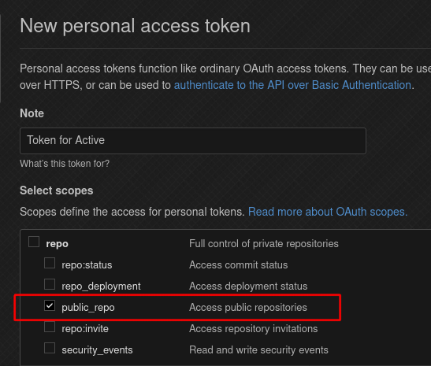

# active


[](https://goreportcard.com/report/github.com/fosskers/active)

*Keep your Github Action versions up-to-date. 使用の Github Actions を最新に！*

<!-- markdown-toc start - Don't edit this section. Run M-x markdown-toc-refresh-toc -->
**Table of Contents**

- [English Guide](#english-guide)
    - [Overview](#overview)
    - [Installation](#installation)
    - [Usage](#usage)
        - [Local Repository](#local-repository)
        - [Batch Updates](#batch-updates)
        - [Automatic PRs](#automatic-prs)
    - [Configuration](#configuration)
        - [OAuth](#oauth)
- [日本語](#日本語)
    - [概要](#概要)
    - [インストール](#インストール)
    - [使用法](#使用法)
        - [手元のリポジトリ](#手元のリポジトリ)
        - [一括処理](#一括処理)
        - [自動的 Pull Request](#自動的-pull-request)
    - [設定](#設定)
        - [OAuth認証](#oauth認証)

<!-- markdown-toc end -->

# English Guide
## Overview

If you use Github CI, you'll recognize fields like this in your Workflow Config:

```yaml
- name: Check out my code
  uses: actions/checkout@v2
```

But wait a minute, these Actions [receive
updates](https://github.com/actions/checkout/releases), so our configs can fall
behind!

`active` scans your projects and queries Github for the latest Action releases,
and updates your configs for you:

```
> active --local
Checking the following files:
  --> .: go.yml

Updates available for .: go.yml:
  actions/setup-go 2 --> 2.0.3
  actions/checkout 2 --> 2.1.0
Would you like to apply them? [Y/n] Y
Updated.
```

## Installation

Assuming you have a [Golang environment set up](https://golang.org/doc/install):

```bash
go get github.com/fosskers/active
```

## Usage

### Local Repository

The simplest usage:

```
active --local
```

This will look for workflow files in `./.github/workflows/`.

### Batch Updates

`active` is meant to be configured and ran on multiple projects at once.
Assuming you've configured it (see below), the default usage "just works":

```
> active
Checking the following files:
  --> aura:     ci.yaml
  --> org-mode: ci.yaml
  --> versions: ci.yaml

... etc ...
```

If you trust `active` to do the right thing, you can use `active -y` to
automatically accept all available updates.

### Automatic PRs

With the `--push` flag, `active` will automatically make a commit on a new
branch, push it to Github, and open a PR:

```
> active --push
Checking the following files:
  --> aura:     ci.yaml
  --> org-mode: ci.yaml
  --> versions: ci.yaml

... work ...

Successfully opened a PR for versions! (#35)
Successfully opened a PR for org-mode! (#15)
Successfully opened a PR for aura! (#314)
```

This requires a valid **Personal Access Token** from Github (see below), and
will also create a new Git *remote* called `active` for each project to ensure
that the token can be used properly for pushing.

## Configuration

A config file is not necessary to use `active`, but having one will make your
life easier. By default, `active` looks for its config file at
`$HOME/.config/active.yaml`. Its contents should look like this:

```yaml
projects:
  - /home/you/code/some-project
  - /home/you/code/another-project
  - /home/you/code/third-project

git:
  name:  Your Name      # (Optional) For --push
  email: you@email.com  # (Optional) For --push
  user:  you            # (Optional) For --push
  token: <oauth-token>  # (Optional) For --push, and higher API rate limits in general.
```

`name` and `email` are used for commiting. `user` is used for branch pushing,
and `token` for opening the PR.

If you want to specify an alternate config location, use `--config`.

### OAuth

If you have a Github account, then it's easy to generate a personal access token
for `active`. First visit the [Token
Settings](https://github.com/settings/tokens) on Github. Click **Generate new
token**, and give it `public_repo` permissions:



# 日本語
## 概要

Github CIの使用の方は下記の設定に見覚えはあるでしょう：

```yaml
- name: Check out my code
  uses: actions/checkout@v2
```

しかしActionsとは [見えない所でアップデートが現れ
る](https://github.com/actions/checkout/releases)物で、こういったアップデートを
見逃してしまう事があります。

`active`はプロジェクトを分析し、使用のActionsを最新のバージョンに更新します：

```
> active --local
Checking the following files:
  --> .: go.yml

Updates available for .: go.yml:
  actions/setup-go 2 --> 2.0.3
  actions/checkout 2 --> 2.1.0
Would you like to apply them? [Y/n] Y
Updated.
```

## インストール

[Golangの開発環境](https://golang.org/doc/install)があれば:

```bash
go get github.com/fosskers/active
```

## 使用法

### 手元のリポジトリ

もっとも簡単な使い方としては：

```
active --local
```

`./.github/workflows/`で見つかる「workflow」ファイルが分析されます。

### 一括処理

本来`active`はファイルで設定され、一括に履行するようにできています。

```
> active
Checking the following files:
  --> aura:     ci.yaml
  --> org-mode: ci.yaml
  --> versions: ci.yaml

... などなど ...
```

設定自体は下記を参考にしてください。

更に`active -y`("yes")で実行すれば、ユーザーの確認を得ずに全ての更新は自動的にさ
れます。

### 自動的 Pull Request

`--push`を加えると`active`は自動的にコミットを作り、ブランチをGithubに送り、新し
いPRが開かれます。

```
> active --push
Checking the following files:
  --> aura:     ci.yaml
  --> org-mode: ci.yaml
  --> versions: ci.yaml

... work ...

Successfully opened a PR for versions! (#35)
Successfully opened a PR for org-mode! (#15)
Successfully opened a PR for aura! (#314)
```

ただしこの場合はGithubからの**Personal Access Token**が必要となります(下記を参考
に)。また、そのTokenが正確に使えるようにプッシュの前、`active`という新しい「Git
remote」が各レポジトリで登録されます。

## 設定

`active`を使うには設定ファイルが特に必要ありませんが、あった方では後が色々と楽になります。
ファイル自体は`$HOME/.config/active.yaml`に置きましょう。内容は以下の様に：

```yaml
projects:
  - /home/daisuke/code/some-project
  - /home/daisuke/code/another-project
  - /home/daisuke/code/third-project

# `--push`を使う時にのみ必須。
git:
  name:  Yamada Daisuke
  email: yamadad@japan.jp
  user:  daisuke
  token: <oauth-token>
```

`--config`にて他の設定ファイルを指定できます。

### OAuth認証

Personal Access Tokenを作るのは簡単です。まずはGithubの[Token
Settings](https://github.com/settings/tokens)のページへ。**Generate new token**
をクリックし、`public_repo`許可のみ与えたら完成です:


